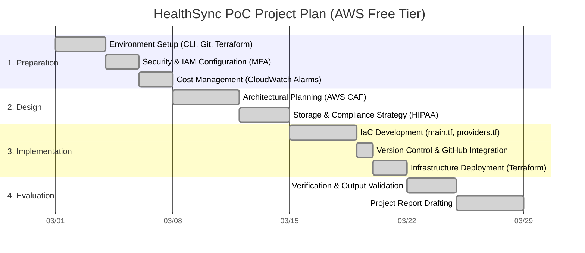

```mermaid
gantt
    title HealthSync PoC Project Plan (AWS Free Tier)
    dateFormat  YYYY-MM-DD
    axisFormat  %m/%d
    tickInterval 1week

    section 1. Preparation
    Environment Setup (CLI, Git, Terraform) :done, task1, 2026-03-01, 3d
    Security & IAM Configuration (MFA)      :done, task2, after task1, 2d
    Cost Management (CloudWatch Alarms)     :done, task3, after task2, 2d

    section 2. Design
    Architectural Planning (AWS CAF)        :done, task4, 2026-03-08, 4d
    Storage & Compliance Strategy (HIPAA)   :done, task5, after task4, 3d

    section 3. Implementation
    IaC Development (main.tf, providers.tf) :done, task6, 2026-03-15, 4d
    Version Control & GitHub Integration    :done, task7, after task6, 1d
    Infrastructure Deployment (Terraform)   :done, task8, after task7, 2d

    section 4. Evaluation
    Verification & Output Validation        :done, task9, 2026-03-22, 3d
    Project Report Drafting                 :done, task10, after task9, 4d
```